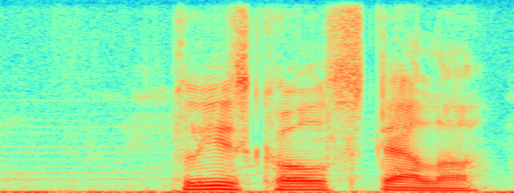
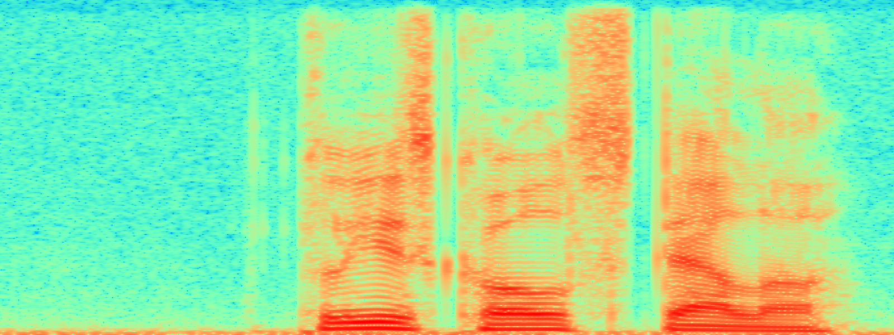
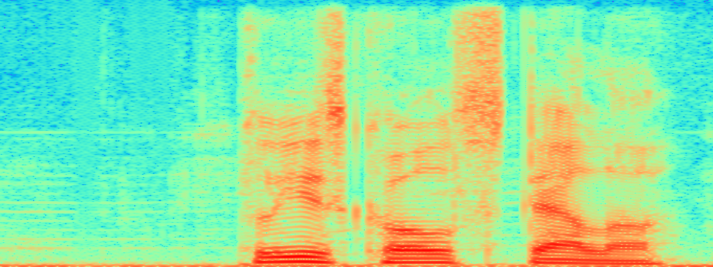
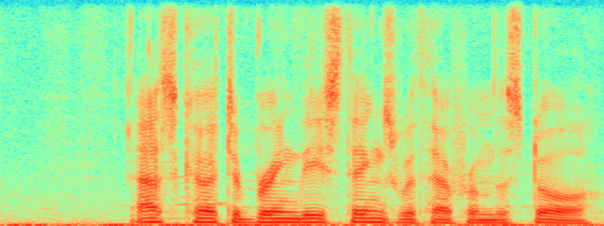
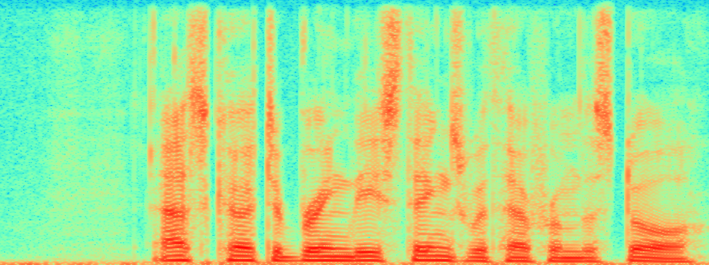
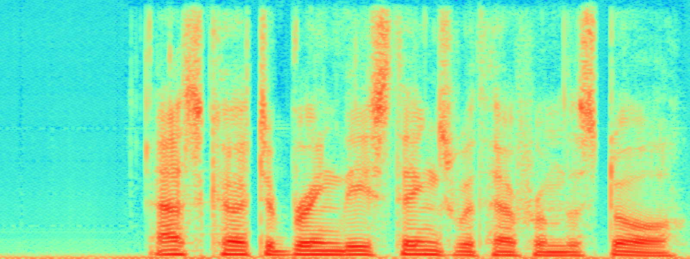
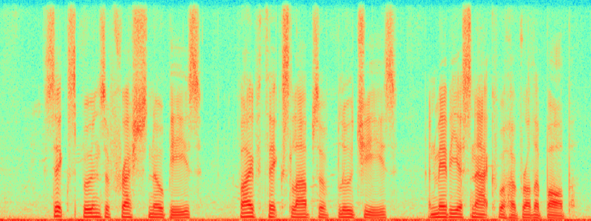
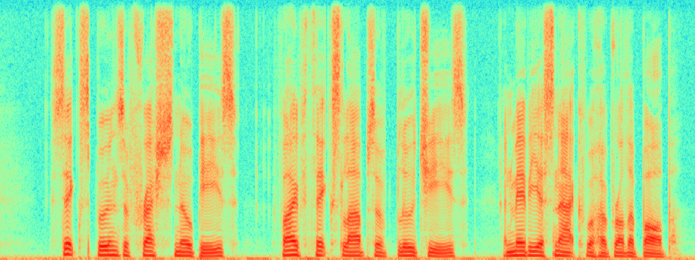
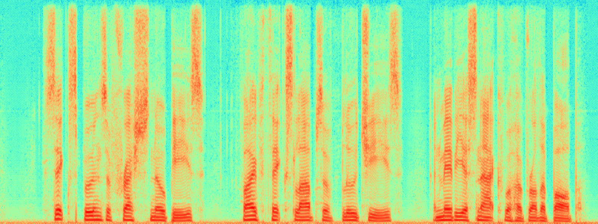

# ROSE: A Recognition-Oriented Speech Enhancement Framework in Air Traffic Control Using Multi-Objective Learning
Xincheng Yu, Dongyue Guo, Jianwei Zhang, Yi Lin
<!DOCTYPE html>
<html lang="en">
<head>
  <meta charset="UTF-8">
  <meta name="viewport" content="width=device-width, initial-scale=1.0">
  
</head>

<body>

p232_001

  

    
    <audio controls id="audio1">
      <source src="./speech_samples/noisy/p232_001.wav" type="audio/wav">
      Your browser does not support the audio element.
    </audio>
    
Noisy

  

  

    
    <audio controls id="audio2">
      <source src="./speech_samples/clean/p232_001.wav" type="audio/wav">
      Your browser does not support the audio element.
    </audio>
    
Clean

  

  

    
    <audio controls id="audio3">
      <source src="./speech_samples/ROSE/p232_001.wav" type="audio/wav">
      Your browser does not support the audio element.
    </audio>
    
ROSE (Ours)

  

p232_002

  

    
    <audio controls id="audio1">
      <source src="./speech_samples/noisy/p232_002.wav" type="audio/wav">
      Your browser does not support the audio element.
    </audio>
    
Noisy

  

  

    
    <audio controls id="audio2">
      <source src="./speech_samples/clean/p232_002.wav" type="audio/wav">
      Your browser does not support the audio element.
    </audio>
    
Clean

  

  

    
    <audio controls id="audio3">
      <source src="./speech_samples/ROSE/p232_002.wav" type="audio/wav">
      Your browser does not support the audio element.
    </audio>
    
ROSE (Ours)

  

p232_003

  

    
    <audio controls id="audio1">
      <source src="./speech_samples/noisy/p232_003.wav" type="audio/wav">
      Your browser does not support the audio element.
    </audio>
    
Noisy

  

  

    
    <audio controls id="audio2">
      <source src="./speech_samples/clean/p232_003.wav" type="audio/wav">
      Your browser does not support the audio element.
    </audio>
    
Clean

  

  

    
    <audio controls id="audio3">
      <source src="./speech_samples/ROSE/p232_003.wav" type="audio/wav">
      Your browser does not support the audio element.
    </audio>
    
ROSE (Ours)

  

</body>
</html>
